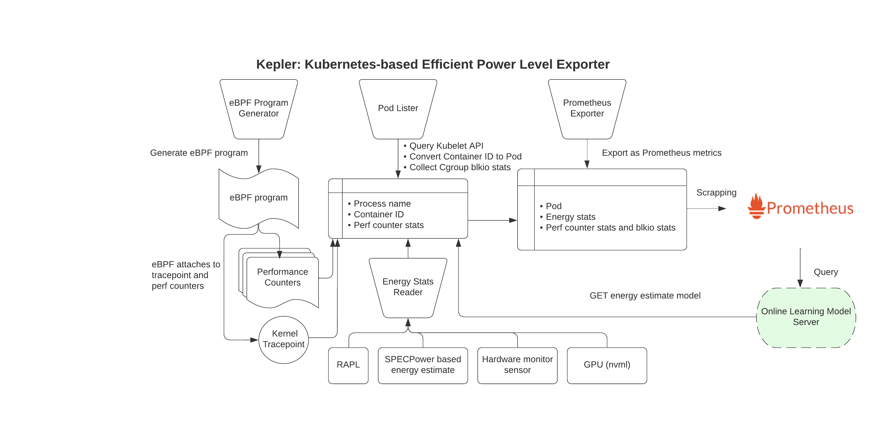
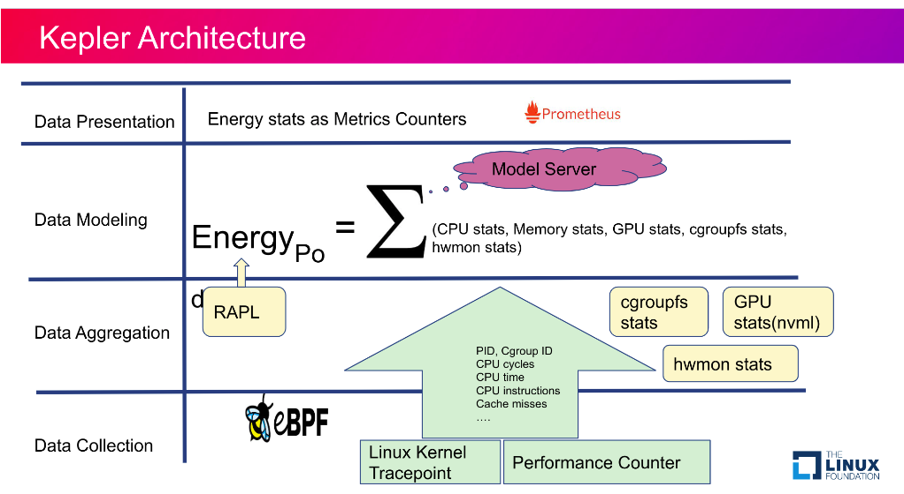

:guid: %guid%
:user: %user%
:ssh_command: %ssh_password%
:bastion_public_hostname: %bastion_public_hostname%
:bastion_ssh_user_name: %bastion_ssh_user_name%
:bastion_ssh_password: %bastion_ssh_password%
:openshift-console-url: %openshift_console_url%
:openshift-api-url: %openshift_api_url%
:openshift-cluster-ingress-domain: %openshift_cluster_ingress_domain%
:openshift-kubeadmin-password: %openshift_kubeadmin_password%
:markup-in-source: verbatim,attributes,quotes

== Overview

This lab gives a hands on experience on how to use Kepler to measure container energy consumption.

== Intro

Kepler

Kepler (Kubernetes-based Efficient Power Level Exporter) is a Prometheus exporter. It uses eBPF to probe CPU performance counters
and Linux kernel tracepoints. These data and stats from cgroup and sysfs can then be fed into ML models to estimate energy consumption
by Pods.

